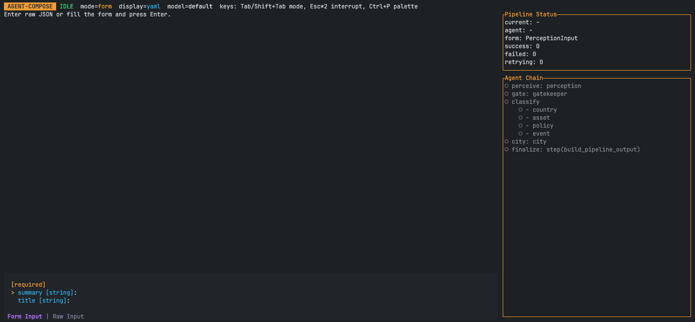
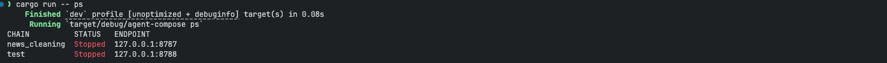

# agent-compose

[](https://github.com/SKKUGoon/agent-compose/actions/workflows/agent-compose.yml)


`agent-compose` is a Rust CLI for running multi-step AI pipelines from YAML. You define a chain once, then run it locally, expose it as HTTP/MCP, or call it from other tools.

## Quick start

```bash
git clone https://github.com/SKKUGoon/agent-compose.git
cd agent-compose
cp .env.example .env
# set OPENAI_API_KEY in .env
cargo build
```

Example build output:

```text
$ cargo build
   Compiling agent-compose v0.1.0 (.../agent-compose)
    Finished `dev` profile [unoptimized + debuginfo] target(s) in 3.42s
```

## Run a chain (interactive/plain mode)

```bash
cargo run -- run --config agent-compose.yaml --chain news_cleaning --plain
```

Example session:

```text
$ cargo run -- run --config agent-compose.yaml --chain news_cleaning --plain
agent-compose interactive mode. Type /quit to exit.
Commands: /json on|off
You> Oil shipments were delayed near the Red Sea after military activity.
Agent> gatekeeper=pass reason=Geopolitical conflict with market relevance
Agent> Regional military activity disrupted shipping lanes and raised commodity risk.
You> /quit
```

## Serve and call

Start servers for all chains in `agent-compose.yaml`:

```bash
cargo run -- serve start --config agent-compose.yaml
```

Check process table:

```bash
cargo run -- ps --config agent-compose.yaml
```

Example output:

```text
$ cargo run -- ps --config agent-compose.yaml
CHAIN         STATUS   ENDPOINT
news_cleaning Running  127.0.0.1:8787
test          Running  127.0.0.1:8788
```

Call a running chain:

```bash
cargo run -- call "Turkey's central bank signaled tighter policy after inflation surprise." \
  --config agent-compose.yaml \
  --chain news_cleaning \
  --json
```

Example output (shortened):

```json
{
  "ok": true,
  "result": {
    "passed_gatekeeper": true,
    "gatekeeper_reason": "Macro policy signal with financial relevance",
    "summary_distilled": "Turkey's central bank...",
    "countries": [
      {
        "country": "Turkey",
        "note": "Directly referenced"
      }
    ]
  },
  "error": null
}
```

## `agent-compose.yaml` (what you edit most)

This file is your workflow control center.

- `version: "2"`: uses the v2 engine.
- `chains`: each chain is an independently runnable pipeline.
- `provider`: model vendor settings and API key via env interpolation (for example `${env:OPENAI_API_KEY}`).
- `runtime`: execution behavior (`context_mode`, retries, and optional gatekeeper skip policy).
- `agents`: each agent has instructions plus strict `input_model` and `output_model`.
- `tasks`: DAG execution graph.
  - Single-agent task: `agent: ...`
  - Parallel multi-agent task: `agents: [...]`
  - Rust step task: `step: build_pipeline_output`
- `output.from`: final value path returned by the chain.

In this repo, `news_cleaning` runs this flow:

`perceive -> gate -> classify (parallel country/asset/policy/event) -> city -> finalize`

`gatekeeper_controlled` skip policy is enabled, so selected tasks can be skipped when `passed_gatekeeper` is false.

## `datamodels.yaml` (your input/output contract)

This file defines every model used by agents and tasks.

- Models are strongly typed objects.
- Fields support primitive types, arrays, enums, defaults, nullability, and `$ref`.
- Agent IO is validated against these models, so outputs stay predictable.

In this repo, important models include:

- `PerceptionInput` / `PerceptionOutput`
- `GatekeeperInput` / `GatekeeperOutput`
- `CountryOutput`, `AssetOutput`, `PolicyOutput`, `EventOutput`, `CityOutput`
- `PipelineOutput` (final response contract)

If you want to change final API shape, start with `PipelineOutput` in `datamodels.yaml` and keep tasks aligned with it.

## CLI usage screenshots

Place screenshots in `./images` using these names:





## MCP spec command

```bash
cargo run -- mcp_spec --config agent-compose.yaml --all --pretty
```

Example output (shortened):

```json
{
  "servers": [
    {
      "name": "news_cleaning",
      "transport": "http",
      "server_url": "http://127.0.0.1:8787/rpc",
      "tools": [
        {
          "name": "infer",
          "description": "Run agent-compose chain inference"
        }
      ]
    }
  ]
}
```

## Version tags (CI trigger)

The GitHub Actions workflow runs only for tags in exact `vX.Y.Z` format.

```bash
git tag v1.2.3
git push origin v1.2.3
```

## License

Apache-2.0. See `LICENSE`.
